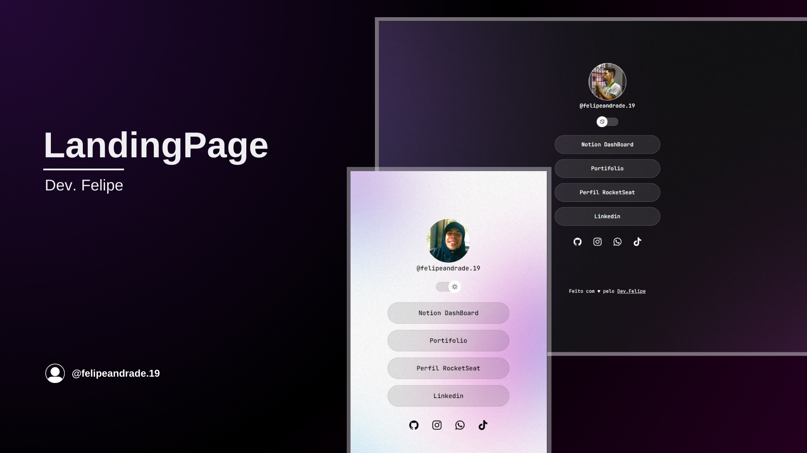

<h1 align="center"> Dev. Felipe - LandingPage </h1>

Projeto para portifolio e interação com pessoas.

  

 

## 🚀 Tecnologias

Esse projeto foi desenvolvido com as seguintes tecnologias:

- HTML e CSS
- JavaScript
- Git e Github
- Figma

## 💻 Projeto

Essa LandingPage é um agregador de links para usar como cartão de visitas online.

- [Acesse o projeto finalizado, online](https://github.com/luisfelipeandrade19/landingPage)

## 🔖 Layout

Você pode visualizar o layout do projeto através [DESSE LINK](https://www.figma.com/community/file/1187422022288947321). É necessário ter conta no [Figma](https://figma.com) para acessá-lo.

## 🔖 Licença

Esse projeto está sob a licença MIT.

É projeto da Rocketseat 

---

